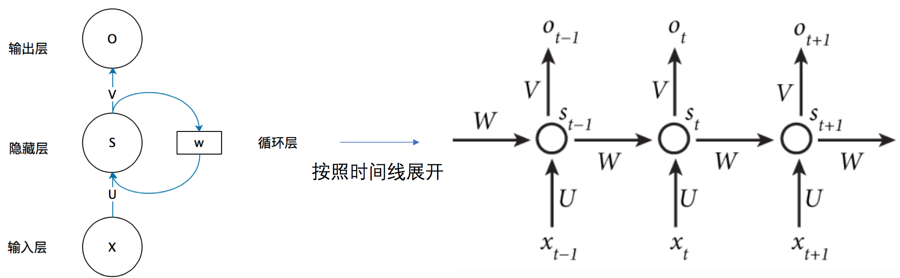
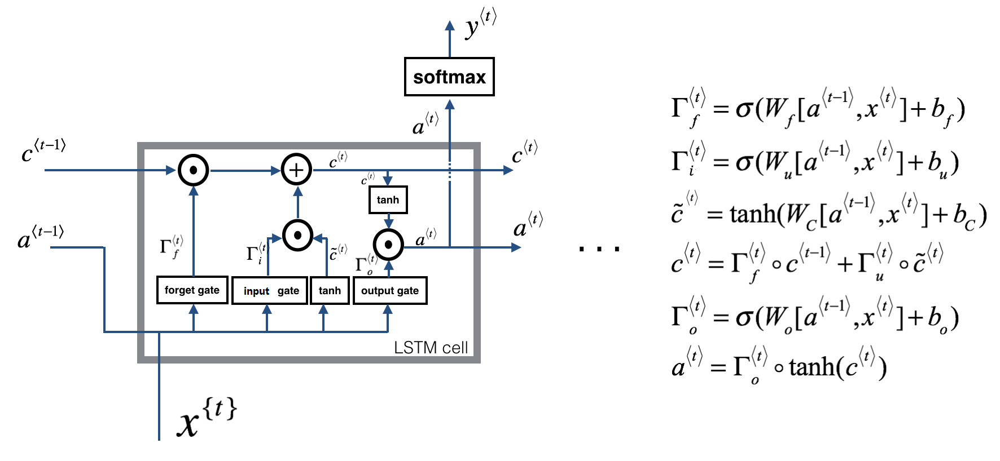
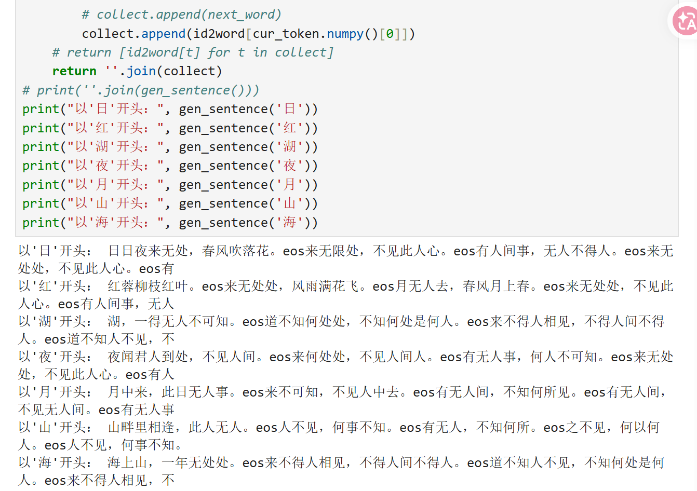

    <h1> RNN 报告</h1>
    
 2253874 邝家琪

    
## 一、解释RNN ，LSTM，GRU模型
    这三种都是循环神经网络，用于处理序列数据（文本、时间序列、语音等），核心思想是：利用上一时刻的状态来影响当前时刻的输出

### 1. RNN（循环神经网络）
    RNN 的逻辑结构可以从下图中看出：  
      
    计算公式为：
    $$
    h_t = \tanh(W_{hh} \cdot h_{t-1} + W_{xh} \cdot x_t + b)
    $$
    
    $$
    y_t = W_{hy} \cdot h_t + b
    $$
    RNN 的本质是参数共享的时间循环，就是所有时间步的RNN 单元共享同一套参数，同一个神经网络在每个时间步被重复使用，只是输入和隐藏状态不同，通过隐藏状态传递信息
    相对于后续改进的LSTM和GRU，RNN循环神经网络结构最简单、计算也快，但是可能会有梯度消失/爆炸的问题，因为RNN的梯度是通过时间反向传播计算的，在链式法则求导过程中，由于连乘，所以权重特征值只要<1，梯度就会指数衰减，导致梯度消失；只要>1，梯度就会指数增长，导致梯度爆炸。并且由于参数量少，所以适合短序列，而难以捕捉长距离依赖，且记忆能力有限。
### 2. LSTM（长短期记忆网络）
    LSTM 的逻辑结构和涉及的公式可以从下图中看出：
     
    相较于RNN，LSTM引入了门控机制和细胞状态，通过权重和偏置的不同，设置遗忘门、输入门、输出门，分别决定丢弃多少旧信息、添加多少新信息以及输出多少信息，目的是通过门控机制控制信息流动。  
    首先，LSTM将当前输入和上一时刻的隐藏状态拼接，然后将拼接后的embedding通过Sigmoid函数得到遗忘门的值（上一时刻细胞状态的保存比例），并且用另一个Sigmoid函数计算输入门的值、利用Tanh函数计算候选值，这样之后，将遗忘门`$f_t$`和旧细胞状态`$C_t-1$`逐元素相乘+输入门`$i_t$`和候选值`$\tilde{C}_t$`逐元素相乘=新细胞状态`$C_t$`。最后，用第三个Sigmoid函数计算输出门的值`$o_t$`，决定细胞状态要输出的部分，并用输出门`$o_t$`与压缩后的细胞状态逐元素相乘得到隐藏状态，即当前时刻的输出和下一时刻的输入之一。
    
    而且梯度计算公式有：
    $$
    \frac{\partial C_t}{\partial C_{t-1}} = f_t + \frac{\partial (i_t \odot \tilde{C}_t)}{\partial C_{t-1}}
    $$
    所以当遗忘门近似1时，梯度可以无损传播到很远的时间步，避免连乘导致的指数衰减，从而解决长距离依赖问题而且梯度也更稳定、不易消失，现在的实际应用非常广泛，但是参数量更大、计算较慢
### 3. GRU（门控循环单元）
    GRU 的逻辑结构是：
     
    重置门：
    $$
    r_t = \sigma(W_r \cdot [h_{t-1}, x_t])
    $$
    
    更新门：
    $$
    z_t = \sigma(W_z \cdot [h_{t-1}, x_t])
    $$
    
    候选值：
    $$
    \tilde{h}_t = \tanh(W_h \cdot [r_t * h_{t-1}, x_t])
    $$
    
    隐藏状态：
    $$
    h_t = (1 - z_t) * h_{t-1} + z_t * \tilde{h}_t
    $$
    首先当前输入和上一刻的历史信息embedding会被拼接，拼接后的embedding通过两个Sigmoid函数可以得到重置门的值（保留历史信息的比例），和更新门的值（新信息替换旧信息的程度），这样之后，将重置门的值向量和上一时刻的历史信息逐元素相乘，得到筛选后的历史信息，将其和当前输入再次拼接，通过tanh函数计算出候选记忆，最后，用更新门融合旧记忆（保留比例1-`$z_t$`）和候选记忆（保留比例`$z_t$`）。  
    由上述机制可以看出，GRU是在LSTM基础上的简化版，因为LSTM的遗忘门和输入们在功能上有重叠，于是将二者合并为更新门，决定保留多少旧信息、添加多少新信息，决定信息保留比例，另一个重置门则决定忽略多少过去信息。由于合并化简，所以GRU参数比LSTM少、计算比LSTM快，但是表达能力以及在超长序列上的表现可能不如LSTM

## 二、诗歌生成过程
    我们的训练数据集是一个唐诗  文本文件poems.txt，每行格式为标题：内容，整体的训练目标是训练一个字符级语言模型，给定一段已生成的文字，预测下一个字；整体训练完成后，从起始标记bos开始，让模型不断自回归地生成新文字，直到指定长度。  
    1. 第一部分是数据预处理，读取数据集文本后，在每行的诗歌内容前后分别加上起始标记和结束标记bos和eos，并且这个训练过程较为特殊之处在于会过滤掉长度超过200字的句子，避免序列过长；  
    然后这次使用的词表不是调用现有词表，而是根据数据集自行构建的，会统计所有出现过的字符的频率、按频率降序排序，并在最前面加上两个特殊标记，PAD表示填充、用于将不同长度的句子对齐；UNK表示未知、处理训练时未出现的字。再为每个字分配一个唯一整数ID，就能够得到word2id字典和反向的1d2word字典。  
    这样之后将每首诗的文字替换成对应的整数ID、记录每首诗包括bos和eos的长度，就能得到instances列表，每个元素为（词索引序列，原始长度）。  
    2. 第二部分是数据打包和处理，首先将instances转为Dataset，创建TensorFlow数据集，每个样本是（索引序列，长度），并且打乱顺序、防止过拟合；  
    然后按批次大小100打包，序列长度不一致时自动用PAD填充到该批次最大长度，那么每个批次数据为（填充后的序列，原始长度）；  
    对于每个样本，原始序列从序号0到序号倒数第二作为训练输入，从序号1到最后一个序号作为训练目标，一一对应，这样，模型在每个时间步的任务就是根据前t个字预测第t+1个字；  
    其中损失函数用交叉熵损失函数，直接输入整数标签，而非one-hot，对每个时间步的预测与真实字计算交叉熵，然后去所有时间步的平均；  
    又由于填充部分PAD不参与损失计算，所以构造掩码，使得能够使用 GradientTape 记录前向传播、计算损失、求导得到梯度、Adam优化，直到所有批次训练完毕，模型就训练完毕。  
    3. 该诗歌生成模型结构为双层RNN，其中嵌入层输入词索引，将离散的字符映射为连续向量空间中的点，故输出稠密向量，输入的第一个字是起始符号bos的ID，而RNN层对每个时间步计算隐藏状态和当前步的输出向量，输入全连接层，将状态映射到词表大小，从而得到每个时间步对词表中每个字的得分，形状（batch,seq_len,vocab_size），用argmax选择概率最高的字作为下一个字，然后将这个字作为下一轮大的输入，同时更新状态，直到生成达到预设长度后或者遇到eos标记时停止。  
    至此，诗歌生成完毕。  

## 三、生成开头词汇是 “ 日 、 红 、 山 、 夜 、 湖、 海 、 月 ” 的诗歌  
      